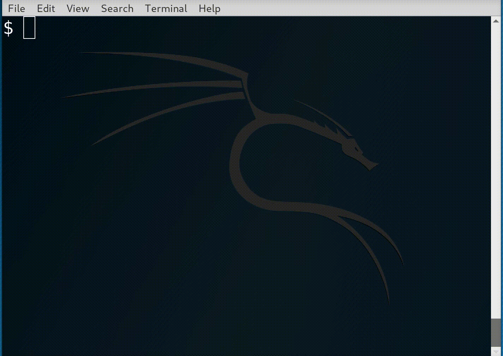

You could append it to your ```.bashrc``` but I find it easier to manage in
```.bash_aliases```. It uses ```top``` at the mo therefore inherits whatever
processor breakdown you have. By default ```top``` only displays one processor
- hit '1' to show all CPUs and 'W' to save as a default.


