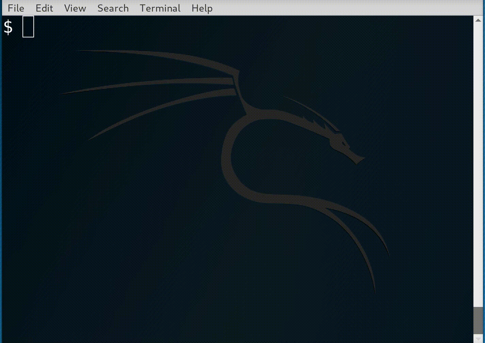

You could append it to your ```.bashrc``` but I find it easier to manage in
```.bash_aliases```. It uses ```top``` to extra system information, therefore
inherits your processor breakdown. By default ```top``` only displays one
processor, hit '1' to show all CPUs and 'W' to save as a default.

Trial it in your current shell:
```bash
source .bash_aliases
```


```bash
# Append to .bashrc or .bash_aliases

cpu-status-string(){

  # Strip CPU info
  cpu_info=$(top -b -n 1 | grep %Cpu | cut -c9-11 | tr '\n' ' ')

  # Create some colours
  idle='\u001b[32m'
  low='\u001b[36m'
  medium='\u001b[33m'
  high='\u001b[31m'
  reset='\u001b[0m'

  # Create the summary by appending a single character for each CPU
  for cpu in $cpu_info; do
    if   (( $cpu < 25 )); then status_string+="$idle\u28c0"
    elif (( $cpu < 50 )); then status_string+="$low\u28e4"
    elif (( $cpu < 75 )); then status_string+="$medium\u28f6"
    else                       status_string+="$high\u28ff"
    fi
  done

  echo -en $status_string$reset
}

PS1='$(cpu-status-string) $ '
```
